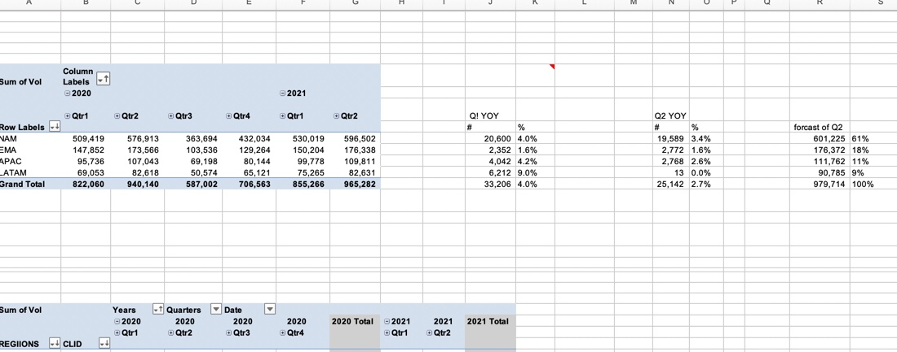

# Widget-Inc-request-and-Analysis
 

## Introduction:
This is an Excel project which is based on a request from Widget Inc. to analyze data on what happened in the second quarter of 2021 and drive insights to answer crucial question and help the company make data driven decisions

**_Disclaimer_**: _All datasets, request and report do not represent any company, institution or country_. 

## Request from The Board  
The board is asking to see how volume looked in Q2. I got some data(attached), but didn't have a chance to pull anything together and was hoping you could take a stab at it. 
I think they just want to see Q2 2021 volume by region and wanted to know if everything was looking good. I think this film has what you need. I don't remember all the region codes - I know NAM ends in  1 , EMEA ends in 3 and APAC and LATER are 2 and 4, but I don't remember which is which. Do know LATAM has the lowest volume so just go ahead and assign that to which ever comes out lowest. 

## Skill set demonstrated:
The following Excel features were incorporated;
- Data Wrangling
- Index and match function
- Round Function
- SUMIFs function
- Pivot table.

## Data Wrangling:
This phase has a lot to do with making the data analysis ready. below are the volume data before and after Data wrangling. 

Volume Data before Wrangling:
 

volume Data after wrangling:
 

GEOID Data before wrangling
 

GEOID data after Wrangling
 

## Analysis 
- Pivot table
The analysis shows seasonality in Volume by region for each quarter through (2020-2021).
- In Q2 2021 Widget Inc had a total of 50 customers.
- Q2 also has a total of 965k volume, with the region NAM having the Highest Volume while LATAM has the lowest volume among regions.

 

## Visualizations 

The visual compares volume year over year using percentage Variance.

 

 

## Key notes 
- Q2 YoY growth slowed from Q1 growth of 4% to 2.7%, driven by 7k volume decline from loss of two customers in LATAM.
- 
- 

